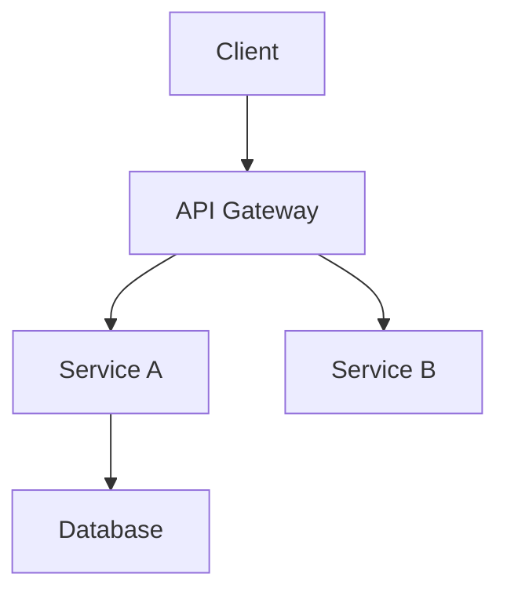

# Architecture

I will help you create architecture diagrams for your project.

## Guardrails
- Base diagrams on actual code structure
- Keep diagrams simple and focused
- Use consistent notation
- Update when architecture changes

## Steps

### 1. Understand Scope
Ask clarifying questions:
- What level of detail? (high-level, component, class)
- What aspects? (data flow, deployment, etc.)
- Who is the audience?
- What format? (Mermaid, C4, etc.)

### 2. Analyze Architecture
Examine the codebase:
- Main components/services
- Data flow between them
- External dependencies
- Deployment structure

### 3. Choose Diagram Type
Select appropriate format:
- **Context**: System in its environment
- **Container**: High-level components
- **Component**: Internal structure
- **Sequence**: Flow over time
- **ER Diagram**: Data relationships

### 4. Create Diagram
Using Mermaid or similar:

### 5. Document
Add explanations:
- What each component does
- Key decisions and tradeoffs
- Links to detailed docs

## Principles
- Don't try to show everything in one diagram
- Use consistent colors and shapes
- Keep text labels short
